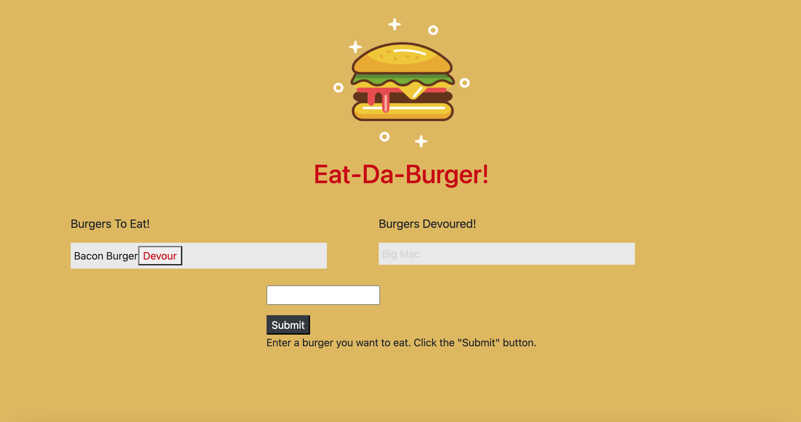

# Unit 13 Homework: Eat-Da-Burger

## Description
Eat-Da-Burger! is a restaurant app that lets users input the names of burgers they'd like to eat. Whenever a user submits a burger's name, this app displays the burger on the left side of the page -- waiting to be devoured. Each burger in the waiting area also has a Devour! button. When the user clicks it, the burger moves to the right side of the page. This app stores every burger in a database, whether devoured or not.

## Table of Contents
* [Installation](#installation)
* [Usage](#usage)
* [Technology Used](#technology)
* [Questions](#questions)

## Installation
To install necessary dependencies, run the following command.
````bash
npm i
````

## Usage
Visit the website (linked below) and start inputting and devouring burgers!

https://immense-basin-51141.herokuapp.com/



## Technology Used
* JS ES6 
* NODE.JS 
* Heroku 
* MYSQL 
* NPM 
* HTML + CSS

## Questions
If you have any questions about the repo, open an issue or contact me directly at [kelseyeckelberry@gmail.com](kelseyeckelberry@gmail.com). You can find more of my work at [kelseyeckelberry](https://github.com/kelseyeckelberry). 
